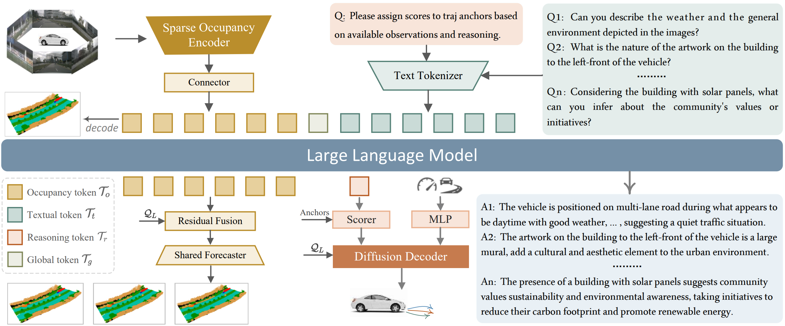

<div align="center">
<h3> SparseOccVLA: Bridging Occupancy and Vision-Language Models via Sparse
Queries for Unified 4D Scene Understanding and Planning</h3>

<a href="https://arxiv.org/abs/2601.06474"></a>
<a href="https://msundyy.github.io/SparseOccVLA/"></a>
[](https://huggingface.co/MSunDYY2001/SparseOccVLA)

<div align="center">

[Chenxu Dang](https://msundyy.github.io)<sup>1,2,3\*</sup>, Jie Wang<sup>2</sup>, Guang Li<sup>2</sup>, Zhiwen Hou<sup>2</sup>, Zihan You<sup>3</sup>, Hangjun Ye<sup>2</sup>, 

Jie Ma<sup>1</sup>, Long Chen<sup>2†</sup>, Yan Wang<sup>3†</sup>  


<sup>1</sup>Huazhong University of Science and Technology  
<sup>2</sup>Xiaomi EV   <sup>3</sup>Institute for AI Industry Research (AIR), Tsinghua University

(\*) Work done during the internship at Xiaomi EV and AIR. (†) Corresponding authors.  
<div align="left">

## Abstract

In autonomous driving, Vision Language Models (VLMs) excel at high-level reasoning , whereas semantic occupancy provides fine-grained details. Despite significant progress in individual fields, there is still no method that can effectively integrate both paradigms. Conventional VLMs struggle with token explosion and limited spatiotemporal reasoning, while semantic occupancy provides a unified, explicit spatial representation but is too dense to integrate efficiently with VLMs. To address these challenges and bridge the gap between VLMs and occupancy, we propose SparseOccVLA, a novel vision-language-action model that unifies scene understanding, occupancy forecasting, and trajectory planning powered by sparse occupancy queries. Starting with a lightweight Sparse Occupancy Encoder, SparseOccVLA generates compact yet highly informative sparse occupancy queries that serve as the single bridge between vision and language. These queries are aligned into the language space and reasoned by the LLM for unified scene understanding and future occupancy forecasting. Furthermore, we introduce an LLM-guided Anchor-Diffusion Planner featuring decoupled anchor scoring and denoising, as well as cross-model trajectory-condition fusion. SparseOccVLA achieves a 7\% relative improvement in CIDEr over the state-of-the-art on OmniDrive-nuScenes, a 0.5 increase in mIoU score on Occ3D-nuScenes, and sets state-of-the-art open-loop planning metric on nuScenes benchmark, demonstrating its strong holistic capability.


<div align="left">

## Overview


</div>

<div align="left">

## News

- **`2026/1.13`**: The paper is released on [arXiv](https://arxiv.org/abs/2601.06474). 

## To DO
- [ ] Release the Code and checkpoints as soon as possible.

## Acknowledgement

Our code is developed based of following open source codebases:
- [OPUS](https://github.com/jbwang1997/OPUS)
- [OmniDrive](https://github.com/NVlabs/OmniDrive)
- [HERMES](https://github.com/LMD0311/HERMES)
- [SparseWorld](https://github.com/MSunDYY/SparseWorld)

We sincerely appreciate their outstanding works.

## Citation

If you find our work helpful or interesting, don’t forget to give us a ⭐. Thanks for your support!

If this work is helpful for your research, please consider citing:

```
@article{dang2026sparseoccvla,
  title={SparseOccVLA: Bridging Occupancy and Vision-Language Models via Sparse Queries for Unified 4D Scene Understanding and Planning}, 
  author={Dang, Chenxu and Wang, Jie and Li, Guang and You, Zihan and Ye, Hangjun and Ma, Jie and Chen, Long and Wang, Yan},
  journal={arXiv preprint arXiv:2601.06474},
  year={2026}
}
```
```
@article{dang2025sparseworld,
  title={SparseWorld: A Flexible, Adaptive, and Efficient 4D Occupancy World Model Powered by Sparse and Dynamic Queries},
  author={Dang, Chenxu and Liu, Haiyan and Bao, Guangjun and An, Pei and Tang, Xinyue and Ma, Jie and Sun, Bingchuan and Wang, Yan},
  journal={arXiv preprint arXiv:2510.17482},
  year={2025}
}
```
